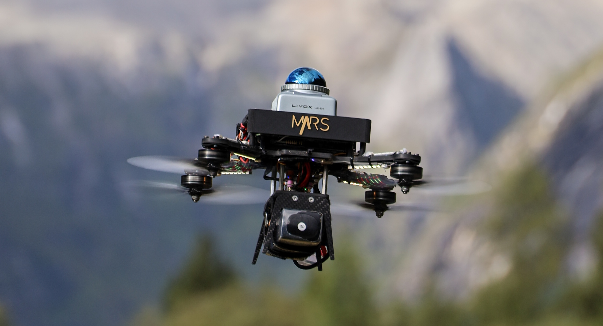
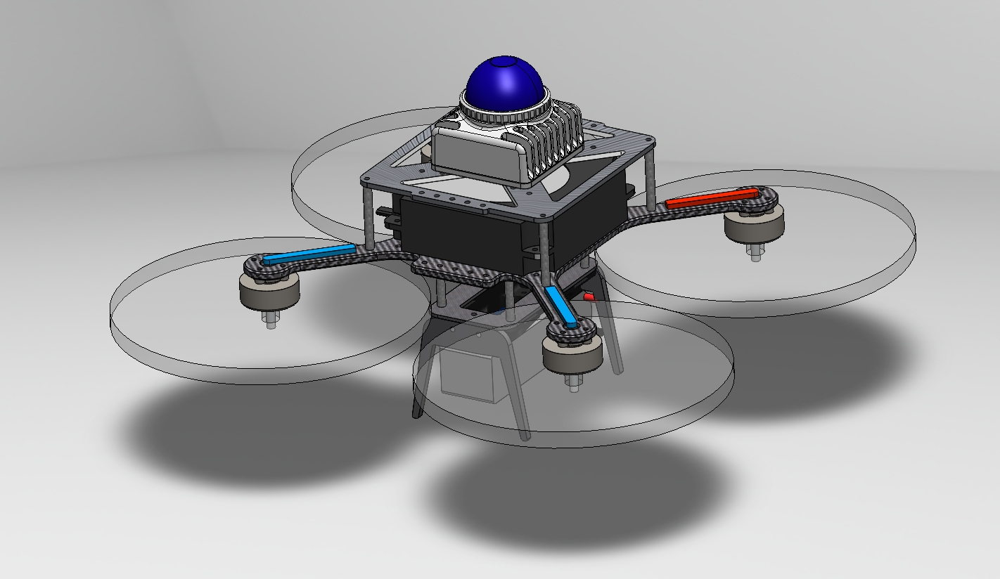
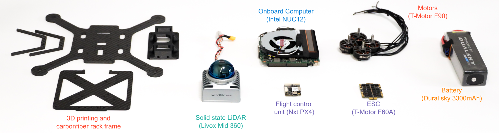

# SUPER-Hardware

This repository contains the hardware components of the SUPER project. See the software part of SUPER at [hku-mars/SUPER (github.com)](https://github.com/hku-mars/SUPER)

If the following resources is useful to you, please cite our paper with

```bibtex
@article{ren2025safety,
  title={Safety-assured high-speed navigation for MAVs},
  author={Ren, Yunfan and Zhu, Fangcheng and Lu, Guozheng and Cai, Yixi and Yin, Longji and Kong, Fanze and Lin, Jiarong and Chen, Nan and Zhang, Fu},
  journal={Science Robotics},
  volume={10},
  number={98},
  pages={eado6187},
  year={2025},
  publisher={American Association for the Advancement of Science}
}
```



## Provided Materials

We provide the following resources:

* Editable drafts and assemblies in SolidWorks: [./SolidWorks](./SolidWorks)
  * 

* `.step` files for 3D printing: [./3DPrinting](./3DPrinting)

* `.step` files for carbon fiber cutting and engraving: [./CarbonFiber](./CarbonFiber)

Bill of Materials (BOM) for additional components with reference links (see table below)

## Hardware Breakdown

The hardware structure is illustrated below:



## BOM

| Name                       | Type                          | Number | Reference Link                                               |
| -------------------------- | ----------------------------- | ------ | ------------------------------------------------------------ |
| LiDAR                      | Livox MID360                  | 1      | [Livox Mid-360 (livoxtech.com)](https://www.livoxtech.com/mid-360) |
| LiDAR Connecting Cable     | N/A                           | 1      | [无名创新 Livox M12航插一分二数据线 mid360数据线 电赛无人机-淘宝网 (taobao.com)](https://item.taobao.com/item.htm?abbucket=6&id=841090466365&ns=1&pisk=g8SZeKqCfnfBhD6POgxq8lOVWlt9inP7biOXntXDCCAM1tvD06fbBC606sS2ttQ_BENt3AIFami_6PBm0nt0N7Z7VOH9DnVW3LwOUfp6hjqXinqHXKTTOJGQVOB9MAl0FwqSggUzIA0DisxH-KpJmdAmSv2e3LRDmCYmt2vktnAciFqHtKpynIAije2eBLvMiVxDK2vyHq0Gin2FKBpDmdcOPELtMLYg3npabr0oyFAlIBomqYpwSzBslmifmdYNmqdKm9seQFRlQG3ADoJVrg8OZWg6sa7faL1_xc5PI17krGc3TnBCzsJPj80yg1Bhfejgh4ppDNbkjiPrs9TPxGtO87oWZwBc0eXTa4pCoTs1u1NKmC_PK685AXiWxG5Nje-l4JGvKA61DNlmuFvpLQwULoIR2bF4a_MKkqLhtpR7BUuxkFYMLQwULq3vWVJeNRLP.&priceTId=213e043617415266898063992e1277&skuId=5777396090918&spm=a21n57.1.hoverItem.9&utparam={"aplus_abtest"%3A"eb7d480f961652917f78181296850d29"}&xxc=taobaoSearch) |
| Onboard Computer           | Intel NUC                     | 1      | [ASUS NUC 12 Pro｜NUCs｜ASUS Global](https://www.asus.com/displays-desktops/nucs/nuc-kits/asus-nuc-12-pro/) |
| Aluminum Standoffs Pillars | 40 mm * 3 mm                  | 4      |                                                              |
| Aluminum Standoffs Pillars | 30 mm * 3 mm                  | 4      | (Or 8 pcs 40 mm * 3mm)                                       |
| Motor                      | T-Motor F90 KV1300            | 4      | [T-MOTORHOBBY F90 2806.5 Long Range Motor - 1300KV/1500KV/1950KV_Motor_F Series Racing Power_FPV Drone Parts_Tmotorhobby Store-Tmotorobby drone motor,ESC,Propeller](https://tmotorhobby.com/goods.php?id=1057) |
| ESC                        | T-Motor F60A mini 4 in 1      | 1      | [TMOTOR F60A MINI 20x20 4IN1 ESC for FPV Drones – T-Motor](https://shop.tmotor.com/products/f60a-mini-20x20-4in1-esc) |
| Battery                    | DualSky 3300mAh 6S XP-3300HED | 1      | [cn.dualsky.com/Xpower_LiPos/decc7a90-6c8f-5c0d-d0d4-c8eaced6f5d2.shtml](http://cn.dualsky.com/Xpower_LiPos/decc7a90-6c8f-5c0d-d0d4-c8eaced6f5d2.shtml) |
| Flight Controller          | NxtPx4                        | 1      | [NxtPX4v2(micoair.cn)](https://micoair.cn/docs/NxtPX4v2-fei-kong-yong-hu-shou-ce) |
| RC                         | Radiolink AT9S                | 1      | [AT9S PRO 12 channels transmitter for racing drone, fixed wing, helicopter, glider, cars and boats (radiolink.com.cn)](https://www.radiolink.com.cn/at9spro) |
| Reveiver                   | Radiolink R12DSM              | 1      | [12 channels MINI receiver R12DSM (radiolink.com)](https://www.radiolink.com/r12dsm) |

### Notes:

- **RC and Receiver**: The listed models (Radiolink AT9S and R12DSM) are what we currently use, but alternatives are acceptable.
- **Battery**: Any 6S battery can be used, not necessarily the DualSky model listed.
- **Flight Controller**: Any PX4-compatible flight controller can substitute for the NxtPx4, as the MPC controller may be open-sourced later this year, and our development is based on PX4.

## Acknowledgments

- Special thanks to [NxtPx4](https://github.com/HKUST-Aerial-Robotics/Nxt-FC) for providing an excellent mini flight controller.
- Gratitude to all contributors: **Wenyi Liu**, **Wendi Dong**, **Minghe Chen**, and **Rongpei Dai**.
